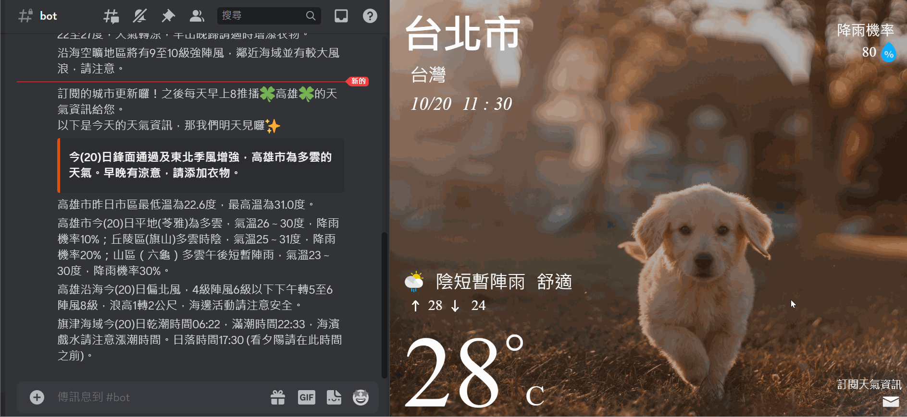

# [狗狗氣象小幫手](http://44.219.151.161:3300/)

提供六都每日天氣預報，並可在 Discord 頻道中訂閱 Disord Bot 都市天氣電子報。

## 主要功能

1. 提供六都目前氣象資料\
   串接氣象資料開放平臺的 API 來提供天氣資訊。
   
2. 訂閱 Discord Bot 電子報\
   使用 Discord webhook 傳送電子報至 Discord 對應的頻道
   
3. 變更訂閱的都市、取消訂閱電子報
   
   

## Tech Stack

- HTML, CSS, JavaScript
- Python Flask
- AWS: EC2, Elastic IP

## 分工表

- 小組組長：陳筱靜
- 小組成員：張凱捷、李亞珊、游晴、黃駿宏、陳筱靜

| 成員   | 負責工作                                                 |
| ------ | -------------------------------------------------------- |
| 游晴   | 六都目前氣象資料（前端）／專案圖片選擇與命名             |
| 黃駿宏 | Discord Bot 電子報（前端）／網站部屬／成果發表／整合輔助 |
| 張凱捷 | 前後端串接／畫面 render（.js）                           |
| 李亞珊 | Discord Bot 電子報（後端）／發表簡報製作                 |
| 陳筱靜 | 組長工作／weather API／整合輔助                          |
